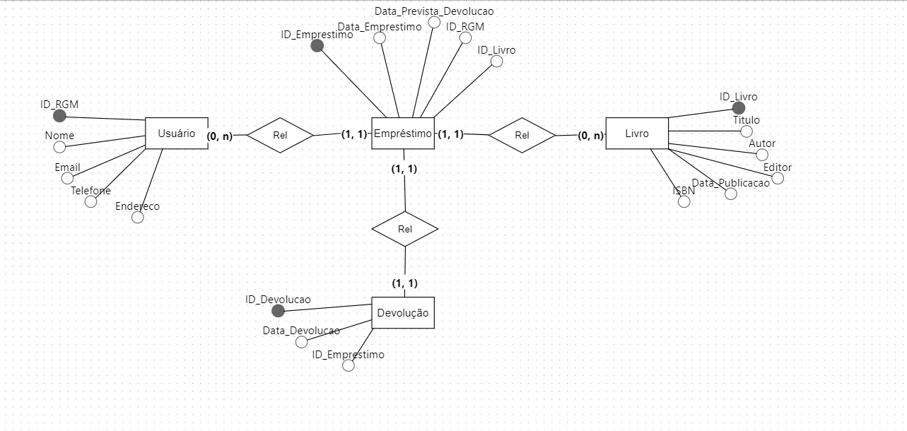
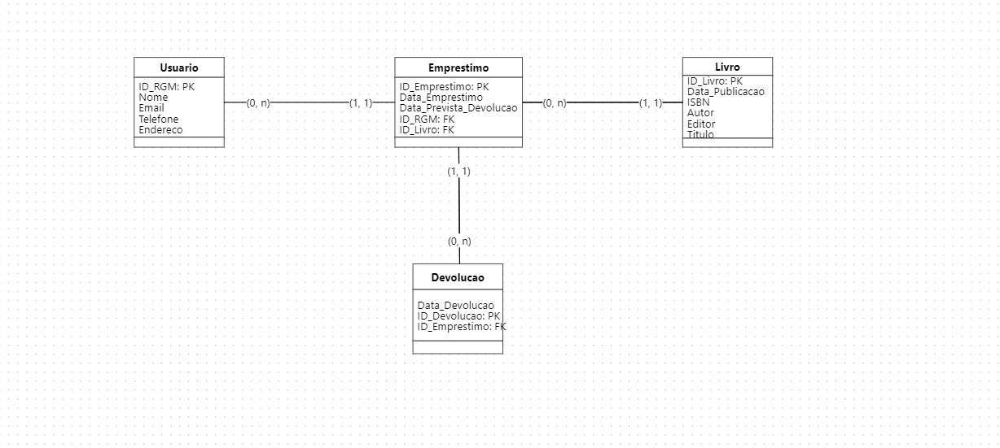
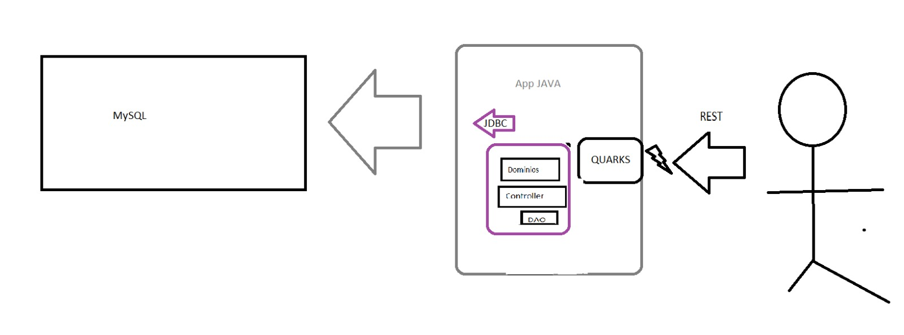

# Documentação
## 1.Visão Geral do Projeto
1.1. Descrição

        Este projeto visa criar um sistema de biblioteca que atenda às necessidades de administração de livros, usuário e emprestimos
    oferecendo um serviço eficiente.

        O objetivo principal deste projeto é um sistema que permita o gerenciamento eficiente do acervo de livros, 
    cadastramento de usuários, funcionalidades de empréstimo e devolução de livros com foco em facilitar a administração de 
    bibliotecas e garantir um controle preciso das operações diárias.
        
1.2. Arquitetura do Sistema

        A arquitetura do sistema de biblioteca utiliza tecnologias e frameworks para garantir um desenvolvimento
    eficiente, escalável e sustentável. O projeto utiliza a seu favor o Maven para gerenciamento de dependências 
    e a construção de projetos Java, Apache Spark e MySQL Connector (via JDBC) são integrados nesta arquitetura
    para serviços RESTFull e conexão ao banco de dados respectivamente.

        Essa arquitetura aproveita as capacidades de Maven para gerenciamento eficiente de dependências, Spark para responder 
    e gerenciar as requisições HTTP pelos serviços RESTfull e MySQL Connector para uma comunicação eficaz com o banco de dados. 
        Esta combinação permite construir um sistema de biblioteca robusto, escalável e fácil de manter.

## 2. Configuração do Ambiente
2.1. Requisitos do Sistema

    Versão: JDK 8 ou superior (JDK 11 recomendado)
    Versão: 3.6.3 ou superior
    Versão: MySQL 5.7 ou superior (MySQL 8.0 recomendado)

2.2. Instalação

2.2.1. Configuração do Projeto

    git clone git@github.com:Bnicole98/bibliotecaNick.git
    cd backend

mvn clean install
mvn exec:java

2.2.2. Configuração do Banco de Dados

    CREATE TABLE Usuario
    (
    ID_RGM INT  AUTO_INCREMENT PRIMARY KEY,
    Nome VARCHAR(30),
    Email VARCHAR(20),
    Telefone VARCHAR(15),
    Endereco VARCHAR(50)
    );
    
    CREATE TABLE Emprestimo
    (
    ID_Emprestimo INT AUTO_INCREMENT PRIMARY KEY,
    Data_Emprestimo DATE,
    Data_Prevista_Devolucao DATE,
    ID_RGM INT,
    ID_Livro INT
    );
    
    CREATE TABLE Livro
    (
    ID_Livro INT AUTO_INCREMENT PRIMARY KEY,
    Data_Publicacao DATE,
    ISBN CHAR(8),
    Autor VARCHAR(20),
    Editor VARCHAR(20),
    Titulo VARCHAR(20)
    );
    
    CREATE TABLE Devolucao
    (
    Data_Devolucao DATE,
    ID_Devolucao INT AUTO_INCREMENT PRIMARY KEY,
    ID_Emprestimo INT
    );
    
    ALTER TABLE Emprestimo ADD FOREIGN KEY(ID_RGM) REFERENCES Usuario (ID_RGM);
    ALTER TABLE Emprestimo ADD FOREIGN KEY(ID_Livro) REFERENCES Livro (ID_Livro);
    ALTER TABLE Devolucao ADD FOREIGN KEY(ID_Emprestimo) REFERENCES Emprestimo (ID_Emprestimo);

# 3. Endpoints REST
   3.1. Endpoints de Usuários

    *   GET /bibliotecaNick/usuario/list -> Obtém uma lista de todos os usuários.

        response:
        [
            {
                "id_rgm":1,
                "nome":"Barrio",
                "email":"valan@gmail.com",
                "telefone":"05898732165",
                "endereco":"Quadra3"
            },
            {
                "id_rgm":2,
                "nome":"Barrio",
                "email":"valan@gmail.com",
                "telefone":"05898732165",
                "endereco":"Quadra3"
            }
        ]

    *   GET /bibliotecaNick/usuario/:id -> Obtém um usuário pelo ID.

       response:
       
       {
           "id_rgm":1,
           "nome":"Barrio",
           "email":"valan@gmail.com",
           "telefone":"05898732165",
           "endereco":"Quadra3"
       }

    *   POST /bibliotecaNick/usuario/inserir -> Inseri as informações de um novo usuário.

    request:

            {
               "nome":"Barrio",
               "email":"valan@gmail.com",
               "telefone":"05898732165",
               "endereco":"Quadra3"
        }

    * PUT /bibliotecaNick/usuario/atualizar/:id -> Atualiza os dados do usuário pelo ID.

    request:

        {
            "nome":"Barrio",
            "email":"valan@gmail.com",
            "telefone":"05898732165",
            "endereco":"Quadra3"

        }

3.2. Endpoints de Livros

    * GET /bibliotecaNick/livro/list -> Obtém uma lista de todos os livros.

    response:
                [
                    {
                        "id_livro":1,
                        "data_publicacao":"2024-10-23",
                        "isbn":"543535","autor":"Xilidrinha",
                        "editor":"Chapolin",
                        "titulo":"MagiaNegra"
                    }
                ]

    *GET /bibliotecaNick/livro/:id -> Obtém as informações de um Livro pelo ID.

    response:

                [
                    {
                        "id_livro":2,
                        "data_publicacao":"2024-10-24",
                        "isbn":"8988765",
                        "autor":"Xama",
                        "editor":"Chilan",
                        "titulo":"Liberdade"
                    }
                ]

    *POST /bibliotecaNick/livro/inserir -> Inseri informações de um novo livro.

    request:

                    {
                        "data_publicacao":"2024-10-24",
                        "isbn":"8988765",
                        "autor":"Xama",
                        "editor":"Chilan",
                        "titulo":"Liberdade"
                    }

    * PUT /bibliotecaNick/livro/atualizar/:id -> Atualiza as informações de um livro pelo ID.

    request:

                    {
                        "data_publicacao":"2024-10-24",
                        "isbn":"8988765",
                        "autor":"Xama",
                        "editor":"Chilan",
                        "titulo":"Liberdade"
                    }

3.3. Endpoints de Emprestimo

    * GET /bibliotecaNick/emprestimo/list -> Obtém uma lista de emprestimos de livros.

    response:
                [
                    {
                        "id_emprestimo":1,
                        "data_emprestimo":"2024-01-24",
                        "data_devolucao":"2024-10-24",
                        "id_rgm":1,
                        "livro":1

                    }
                ]

    * POST /bibliotecaNick/emprestimo/inserir -> Inseri as informações de um novo emprestimo.

    request:

                    {
                        "data_emprestimo":"2024-01-24",
                        "data_devolucao":"2024-10-24",
                        "id_rgm":1,
                        "livro":1
                    }

3.4. Endpoints de Devolucao

    * GET /bibliotecaNick/devolucao/list -> Obtém uma lista das devoluções de livros.

    response:
                [
                    {
                        "id_devolucao":1,
                        "data_devolucao":"2024-01-24",
                        "id_emprestimo":1

                    }

                ]
    * POST /bibliotecaNick/devolucao/inserir -> Insere o dados de uma devolução.

    request:

                {
                    "data_devolucao":"2024-01-24",
                    "id_emprestimo":1
                }
## Modelo Conceitual

## Modelo Físico

## Aplicação

    